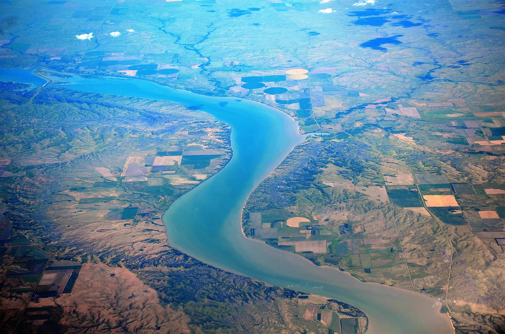
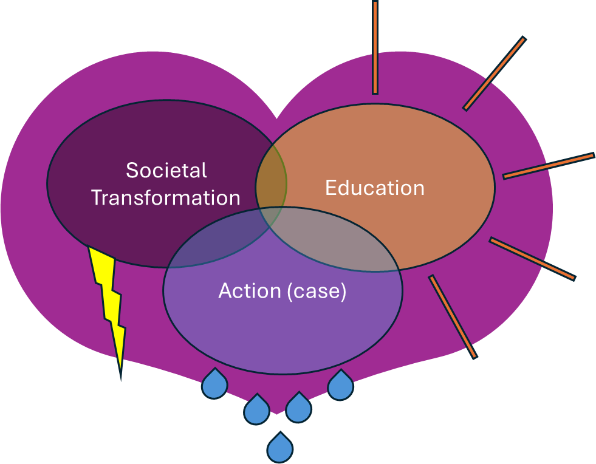
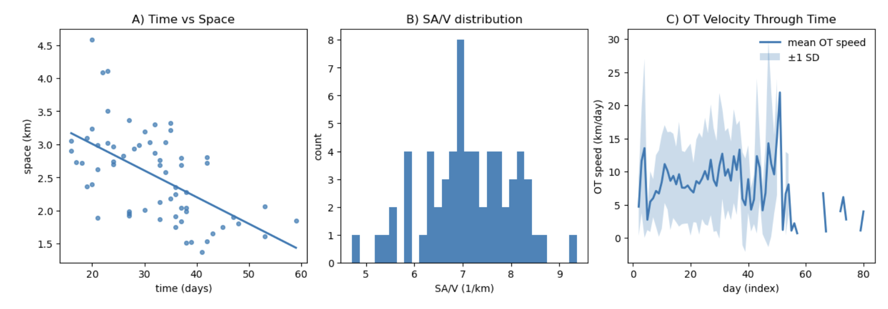

# Mni Awanka (watching over water)

<a href="https://github.com/CU-ESIIL/defining-tipping-points-and-transformation-innovation-summit-2025__1/edit/main/docs/index.md" title="Edit this page">✏️</a>

<!-- =========================================================
HERO (Swap hero.jpg, title, strapline, and the three links)
========================================================= -->

**Impact:** 
As part of the Nopasi Pazo (showing your findings) group, Mni Awanka aims to develop a platform where the indigenous peoples of the Fort Laramie Treaty boundaries 1868 & 1851 area (North and South Dokota, Nebraska, Wyoming, Montana) can access water quality data for remeady, health and environmental justice, and education. 

**Overview**
The Nopasi Pazo group came together based on a mutual interest for indigenous approaches to environmental crises and collaborative action to replace colonizing hegemonic responses. The teams mission is societal transformation (incl. finding new decolonizing models, inherent soverenty, rights, and equitable decision making). Our sub-groups are on education (Wounspé), on building a large language model (LLM) for easier access to environmental assessment reports (He Sapa Makiyuta), and on accessibility of water quality data (Mni Awanka).  

*The Nopasi Pazo Working Group*

**[Read the brief](assets/Seven%20ways%20to%20measure%20fire%20polygon%20velocity-4.pdf) · [View code](https://github.com/CU-ESIIL/defining-tipping-points-and-transformation-innovation-summit-2025__1/blob/main/code/prism_quicklook.py) · [Explore data](https://github.com/CU-ESIIL/defining-tipping-points-and-transformation-innovation-summit-2025__1/blob/main/code/prism_quicklook.py)**

---

## Day 1 — Define the system & opportunities

### Our product 📣
The goal of Mni Awanka is to work towards a dashboard on water quality in Sicangu Makoce (Rosebud Reservation), and the Fort Laramie Treaty boundaries 1868 & 1851 area (North and South Dokota, Nebraska, Wyoming, Montana). The aim of this dashbord is to facilitate access to water quality data for remeady, health and environmental justice, and education. 

### Our question(s) 📣
*Questions for the dashboard:*
- What health hazardous (e.g. cancer causing) chemicals are present in the surface and sub surface water in the Fort Laramie Treaty boundaries 1868 & 1851 (North and South Dokota, Nebraska, Wyoming, Montana)?
- How can we make a platform to ensure this data is accessible and usable for tribal nations for remeady, health-environmental justice, and education? (incl what your federal rights are)

*Overarching questions:*
- What causes the fluctuation of the chemical consentrations?
- What data is missing (and could be aquired through citizen science/sensors)?

> **Different perspectives:** 
After some discussions and consultations we are thinking of working more with a river pollution simulation case as well as building a query model to work with the existing dashboards for easier decision making.
---

## Day 2 — Data, indicators & prototyping
We are looking into two approaches. The data driven approach and the simulation model approach.

- **Data Driven Approach:** For this approach we plan to start with the dataset from [the Sicangu Climate Data Repository](https://sicangudata.org/?submit=Yes%2C+I+am+a+human&ishuman=yes) and develop a library which can be used to query the data for decision making.

- **Simulation Approach:** For this approach we plan to build a simulation model of the Msuri river and potential pollution sources. Here the decision maker can play around with various polution scenarios and query what the drivers could be of the actural measured polution.
  
#### Preliminary results
[Open Simulartion Demo Tool](assets/water_quality_mini_db_self_contained_html.html)  

## Final Share Out — Insights & transformation pathways
*Focus: synthesis; highlight 2–3 visuals that tell the story; keep text crisp. Practice a 2-minute walkthrough of the homepage 📣: Why → Questions → Data/Methods → Findings → Next.*

[Raw photo location: team_photo.jpg](https://github.com/CU-ESIIL/defining-tipping-points-and-transformation-innovation-summit-2025__1/blob/main/docs/assets/team_photo.jpg)

### Findings at a glance 📣
<!-- EDIT: 2–4 bullets, each a headline in plain language with a number if possible. -->
- Headline 1 — what, where, how much
- Headline 2 — change/trend/contrast
- Headline 3 — implication for practice or policy

### Visuals that tell the story 📣

[Raw photo location: fire_hull.png](https://github.com/CU-ESIIL/defining-tipping-points-and-transformation-innovation-summit-2025__1/blob/main/docs/assets/fire_hull.png)
*Visual 1.* Swap in the primary graphic that clearly communicates your core takeaway.

[Raw photo location: hull_panels.png](https://github.com/CU-ESIIL/defining-tipping-points-and-transformation-innovation-summit-2025__1/blob/main/docs/assets/hull_panels.png)
*Visual 2.* Use a complementary panel, collage, or set of snapshots that reinforces supporting evidence.

[Raw photo location: main_result.png](https://github.com/CU-ESIIL/defining-tipping-points-and-transformation-innovation-summit-2025__1/blob/main/docs/assets/main_result.png)
*Visual 3.* Highlight an additional visual that captures a secondary insight or next step.

<iframe
  title="Short explainer video (optional)"
  width="100%" height="360"
  src="https://www.youtube.com/embed/ASTGFZ0d6Ps"
  frameborder="0" allow="accelerometer; autoplay; clipboard-write; encrypted-media; gyroscope; picture-in-picture; web-share"
  allowfullscreen></iframe>

### What’s next? 📣
- Immediate follow-ups
- What we would do with one more week/month
- Who should see this next

---

## Featured links (image buttons)
<table>
<tr>
<td align="center" width="33%">
  <a href="assets/Seven%20ways%20to%20measure%20fire%20polygon%20velocity-4.pdf"> <strong>Read the brief</strong></a>
</td>
<td align="center" width="33%">
  <a href="https://github.com/CU-ESIIL/defining-tipping-points-and-transformation-innovation-summit-2025__1/blob/main/code/prism_quicklook.py"> <strong>View code</strong></a>
</td>
<td align="center" width="33%">
  <a href="https://github.com/CU-ESIIL/defining-tipping-points-and-transformation-innovation-summit-2025__1/blob/main/code/prism_quicklook.py"> <strong>Explore data</strong></a>
</td>
</tr>
</table>

---

## Team
| Name | Role | Contact | GitHub |
|------|------|---------|--------|
| Jane Doe | Lead | jane.doe@example.org | @janedoe |
| John Smith | Analyst | john.smith@example.org | @jsmith |

---

## Storage

**Code**
Keep shared scripts, notebooks, and utilities in the [`code/`](https://github.com/CU-ESIIL/defining-tipping-points-and-transformation-innovation-summit-2025__1/tree/main/code) directory. Document how to run them (README, notebook cells, or comments) so collaborators can reproduce analyses.

**Documentation**
Use the [`docs/`](https://github.com/CU-ESIIL/defining-tipping-points-and-transformation-innovation-summit-2025__1/tree/main/docs) folder to publish public updates on this site. Longer internal notes can live in [`documentation/`](https://github.com/CU-ESIIL/defining-tipping-points-and-transformation-innovation-summit-2025__1/tree/main/documentation); summarize key points here to keep the public story fresh.

---

## Cite & reuse
If you use or share materials from this sprint, please cite:

> ESIIL Innovation Summit Team 1. (2025). *Defining Tipping Points and Transformation*. GitHub. https://github.com/CU-ESIIL/defining-tipping-points-and-transformation-innovation-summit-2025__1

License: CC-BY-4.0 unless noted. See dataset licenses on the **[Data](data.md)** page.

---

<!-- EDIT HINTS
- Upload images to docs/assets/ and reference as assets/filename.png
- Keep GIFs under ~4 MB for smooth playback
- Use headings + bullets for scannability -->
