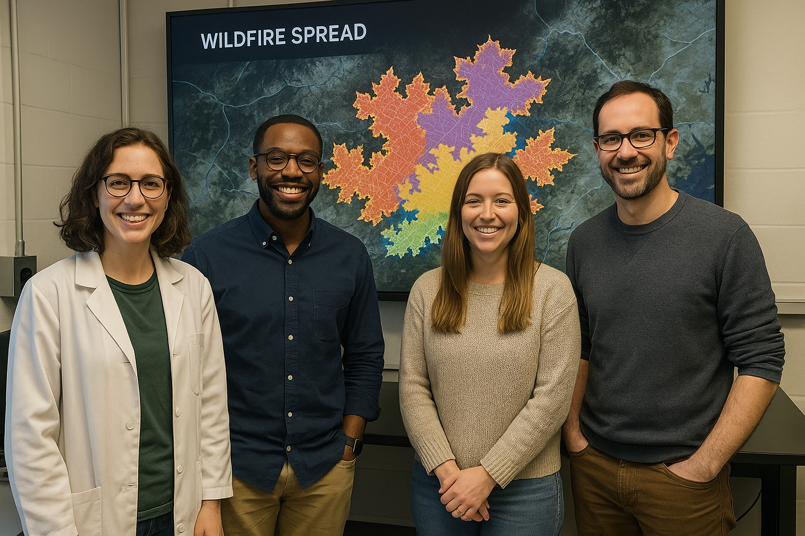

# Mni Awanka (watching over water)

<a href="https://github.com/CU-ESIIL/defining-tipping-points-and-transformation-innovation-summit-2025__1/edit/main/docs/index.md" title="Edit this page">✏️</a>

<!-- =========================================================
HERO (Swap hero.jpg, title, strapline, and the three links)
========================================================= -->

[Raw photo location: hero.jpg](https://github.com/CU-ESIIL/defining-tipping-points-and-transformation-innovation-summit-2025__1/blob/main/docs/assets/River_image.jpg)

**One sentence on impact:** In three days we will lay the foundations of a data platform of the Fort Laramie Treaty boundaries 1868 & 1851 area (North and South Dokota, Nebraska, Wayoming, Montana) for health and environmental justice and education. 

**[Read the brief](assets/Seven%20ways%20to%20measure%20fire%20polygon%20velocity-4.pdf) · [View code](https://github.com/CU-ESIIL/defining-tipping-points-and-transformation-innovation-summit-2025__1/blob/main/code/prism_quicklook.py) · [Explore data](https://github.com/CU-ESIIL/defining-tipping-points-and-transformation-innovation-summit-2025__1/blob/main/code/prism_quicklook.py)**

> **About this site:** This public log captures our Innovation Summit 2025 sprint. Edit any page in your browser → pencil icon → Commit changes. Keep updates short, visual, and decision-oriented.

---

## How to use this page (for the team)
- **Edit this file:** `docs/index.md` → ✎ → change text → **Commit changes**.
- **Add images:** upload to `docs/assets/` and reference them like `assets/your_file.png`.
- **Prioritize clarity:** favor short captions, bold headlines, and 2–3 visuals per section.

---

## Day 1 — Define the system & opportunities
*Focus: shared context, tipping point hypotheses, and team alignment. Add at least one real visual (whiteboard, map, or notes snapshot).* 

### Our product 📣
- What product do you want to create as a team?

Our goal is to work towards a dashboard on water quality in Sicangu Makoce (Rosebud Reservation) which can be used for water quality monitoring and indigenous rights, particularly regarding the increasing cancer rates. 

### Our question(s) 📣
<!-- EDIT: Replace bullets with your own. Encourage divergent takes. -->
- What are we trying to understand or change?
- Why now? Why here?
- Who benefits if we succeed?

Questions:
- What health hazardous (e.g. cancer causing) chemicals are present in the surface and sub surface water in the Fort Laramie Treaty boundaries 1868 & 1851 (North and South Dokota, Nebraska, Wayoming, Montana)?
- How can we make a platform to ensure this data is accessible and usable for tribal nations for remeady, health-environmental justice, and education? (incl what your federal rights are)

Overarching questions:
- What causes the fluctuation of the chemical consentrations?
- What data is missing (and could be aquired through citizen science/sensors)?

### Why this matters (the “upshot”) 📣
<!-- EDIT: 2–3 sentences max, decision-oriented. -->
Explain who is impacted and how this could change decisions or understanding.

### Inspirations (papers, datasets, tools)
<!-- EDIT: Swap in your own links. -->
- 
  
### Field notes / visuals

[Raw photo location: day1_whiteboard.jpg](https://github.com/CU-ESIIL/defining-tipping-points-and-transformation-innovation-summit-2025__1/blob/main/docs/assets/day1_whiteboard.jpg)
*Caption: Capture what the sketch shows and how it guides the next step.*

> **Different perspectives:** Briefly capture disagreements or alternate framings. These can unlock innovation.
---

## Day 2 — Data, indicators & prototyping
*Focus: what we’re testing and building; show a first visual (plot/map/screenshot/GIF).*

### Data sources we’re exploring 📣
<!-- EDIT: Link each source; add size/notes if relevant. -->
- **Source A**
  
  
  [Raw photo location: explore_data_plot.png](https://github.com/CU-ESIIL/defining-tipping-points-and-transformation-innovation-summit-2025__1/blob/main/docs/assets/explore_data_plot.png)
  *Snapshot showing an emerging pattern or early warning signal.*

- Source B — link and 1-line description
  
### Methods / technologies we’re testing 📣
- Approach 1 (e.g., time-series break detection)
- Approach 2 (e.g., random forest on features)
- Visualization (e.g., map tiles, small multiples)

### Challenges identified
- Data gaps / quality issues
- Method limitations / compute constraints
- Open questions we need to decide on

### Visuals
<!-- EDIT: Swap examples; keep file sizes modest. -->
#### Static figure

[Raw photo location: figure1.png](https://github.com/CU-ESIIL/defining-tipping-points-and-transformation-innovation-summit-2025__1/blob/main/docs/assets/figure1.png)
*Figure 1.* One sentence on what the indicator suggests.

#### Animated change (GIF)

[Raw photo location: change.gif](https://github.com/CU-ESIIL/defining-tipping-points-and-transformation-innovation-summit-2025__1/blob/main/docs/assets/change.gif)
*Figure 2.* Describe what shifts over time and how it informs transformation planning.

#### Interactive map or dashboard (iframe)
<iframe
  title="Study area (OpenStreetMap)"
  src="https://www.openstreetmap.org/export/embed.html?bbox=-105.35%2C39.90%2C-105.10%2C40.10&layer=mapnik&marker=40.000%2C-105.225"
  width="100%" height="360" frameborder="0"></iframe>

<a href="https://www.openstreetmap.org/?mlat=40.000&mlon=-105.225#map=12/40.0000/-105.2250">Open full map</a>

> If an embed doesn’t load, include a direct link immediately below it.

---

## Final Share Out — Insights & transformation pathways
*Focus: synthesis; highlight 2–3 visuals that tell the story; keep text crisp. Practice a 2-minute walkthrough of the homepage 📣: Why → Questions → Data/Methods → Findings → Next.*

[Raw photo location: team_photo.jpg](https://github.com/CU-ESIIL/defining-tipping-points-and-transformation-innovation-summit-2025__1/blob/main/docs/assets/team_photo.jpg)

### Findings at a glance 📣
<!-- EDIT: 2–4 bullets, each a headline in plain language with a number if possible. -->
- Headline 1 — what, where, how much
- Headline 2 — change/trend/contrast
- Headline 3 — implication for practice or policy

### Visuals that tell the story 📣

[Raw photo location: fire_hull.png](https://github.com/CU-ESIIL/defining-tipping-points-and-transformation-innovation-summit-2025__1/blob/main/docs/assets/fire_hull.png)
*Visual 1.* Swap in the primary graphic that clearly communicates your core takeaway.

[Raw photo location: hull_panels.png](https://github.com/CU-ESIIL/defining-tipping-points-and-transformation-innovation-summit-2025__1/blob/main/docs/assets/hull_panels.png)
*Visual 2.* Use a complementary panel, collage, or set of snapshots that reinforces supporting evidence.

[Raw photo location: main_result.png](https://github.com/CU-ESIIL/defining-tipping-points-and-transformation-innovation-summit-2025__1/blob/main/docs/assets/main_result.png)
*Visual 3.* Highlight an additional visual that captures a secondary insight or next step.

<iframe
  title="Short explainer video (optional)"
  width="100%" height="360"
  src="https://www.youtube.com/embed/ASTGFZ0d6Ps"
  frameborder="0" allow="accelerometer; autoplay; clipboard-write; encrypted-media; gyroscope; picture-in-picture; web-share"
  allowfullscreen></iframe>

### What’s next? 📣
- Immediate follow-ups
- What we would do with one more week/month
- Who should see this next

---

## Featured links (image buttons)
<table>
<tr>
<td align="center" width="33%">
  <a href="assets/Seven%20ways%20to%20measure%20fire%20polygon%20velocity-4.pdf"> <strong>Read the brief</strong></a>
</td>
<td align="center" width="33%">
  <a href="https://github.com/CU-ESIIL/defining-tipping-points-and-transformation-innovation-summit-2025__1/blob/main/code/prism_quicklook.py"> <strong>View code</strong></a>
</td>
<td align="center" width="33%">
  <a href="https://github.com/CU-ESIIL/defining-tipping-points-and-transformation-innovation-summit-2025__1/blob/main/code/prism_quicklook.py"> <strong>Explore data</strong></a>
</td>
</tr>
</table>

---

## Team
| Name | Role | Contact | GitHub |
|------|------|---------|--------|
| Jane Doe | Lead | jane.doe@example.org | @janedoe |
| John Smith | Analyst | john.smith@example.org | @jsmith |

---

## Storage

**Code**
Keep shared scripts, notebooks, and utilities in the [`code/`](https://github.com/CU-ESIIL/defining-tipping-points-and-transformation-innovation-summit-2025__1/tree/main/code) directory. Document how to run them (README, notebook cells, or comments) so collaborators can reproduce analyses.

**Documentation**
Use the [`docs/`](https://github.com/CU-ESIIL/defining-tipping-points-and-transformation-innovation-summit-2025__1/tree/main/docs) folder to publish public updates on this site. Longer internal notes can live in [`documentation/`](https://github.com/CU-ESIIL/defining-tipping-points-and-transformation-innovation-summit-2025__1/tree/main/documentation); summarize key points here to keep the public story fresh.

---

## Cite & reuse
If you use or share materials from this sprint, please cite:

> ESIIL Innovation Summit Team 1. (2025). *Defining Tipping Points and Transformation*. GitHub. https://github.com/CU-ESIIL/defining-tipping-points-and-transformation-innovation-summit-2025__1

License: CC-BY-4.0 unless noted. See dataset licenses on the **[Data](data.md)** page.

---

<!-- EDIT HINTS
- Upload images to docs/assets/ and reference as assets/filename.png
- Keep GIFs under ~4 MB for smooth playback
- Use headings + bullets for scannability -->
