# Connecting Cyverse to GitHub

## Log in to Cyverse

1. Go to the Cyverse user account website [https://user.cyverse.org/](https://user.cyverse.org/)

2. Click `Sign up` (if you do not already have an account)

   

3. Head over to the Cyverse Discovery Environment [https://de.cyverse.org](https://de.cyverse.org), and log in with your new account.

   

   You should now see the Discovery Environment:

   

4. We will give you permissions to access the Hackathon app. If you haven't already, let us know that you need access

## Open up an analysis with the hackathon environment (Jupyter Lab)

!!! note "Illustrative placeholders"
    The figures embedded in the steps below are lightweight SVG placeholders so the documentation builds without missing-asset warnings. Replace the matching files in `docs/assets/cyverse_basics/` with real screenshots whenever updated imagery is available.

1. From the Cyverse Discovery Environment, click on `Apps` in the left menu
   
   [Raw photo location: apps.svg](https://github.com/CU-ESIIL/defining-tipping-points-and-transformation-innovation-summit-2025__1/blob/main/docs/assets/cyverse_basics/apps.svg)

2. Select `JupyterLab ESIIL`
   
[Raw photo location: use_this_app.svg](https://github.com/CU-ESIIL/defining-tipping-points-and-transformation-innovation-summit-2025__1/blob/main/docs/assets/cyverse_basics/use_this_app.svg)

3. Configure and launch your analysis - when choosing the disk size, make sure to choose 64GB or greater. The rest of the settings you can change to suit your computing needs:
   
[Raw photo location: app_launch.svg](https://github.com/CU-ESIIL/defining-tipping-points-and-transformation-innovation-summit-2025__1/blob/main/docs/assets/cyverse_basics/app_launch.svg)

   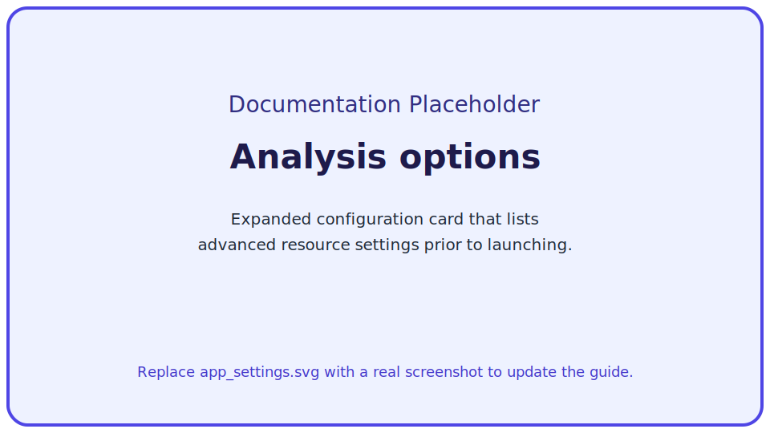
[Raw photo location: app_settings.svg](https://github.com/CU-ESIIL/defining-tipping-points-and-transformation-innovation-summit-2025__1/blob/main/docs/assets/cyverse_basics/app_settings.svg)

   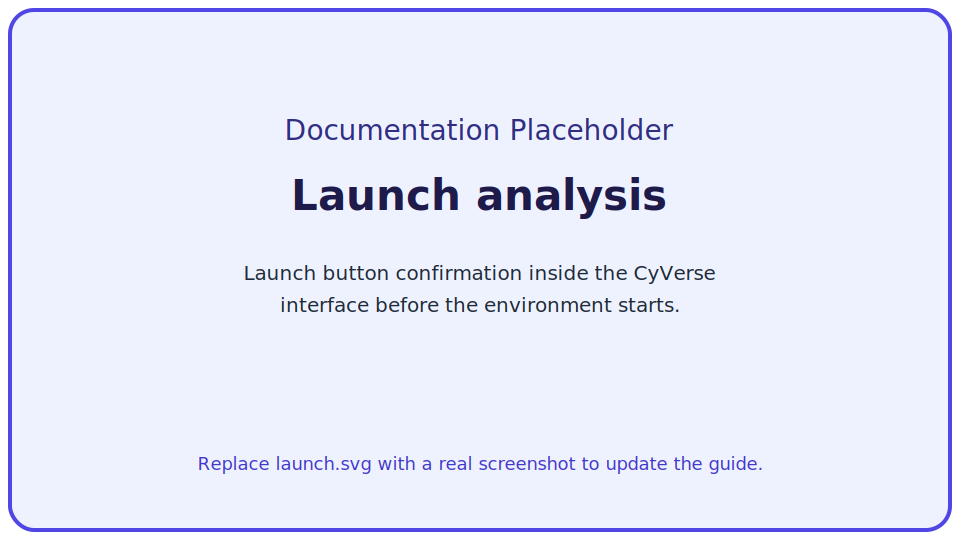
[Raw photo location: launch.svg](https://github.com/CU-ESIIL/defining-tipping-points-and-transformation-innovation-summit-2025__1/blob/main/docs/assets/cyverse_basics/launch.svg)

4. Click `Go to analysis`:
   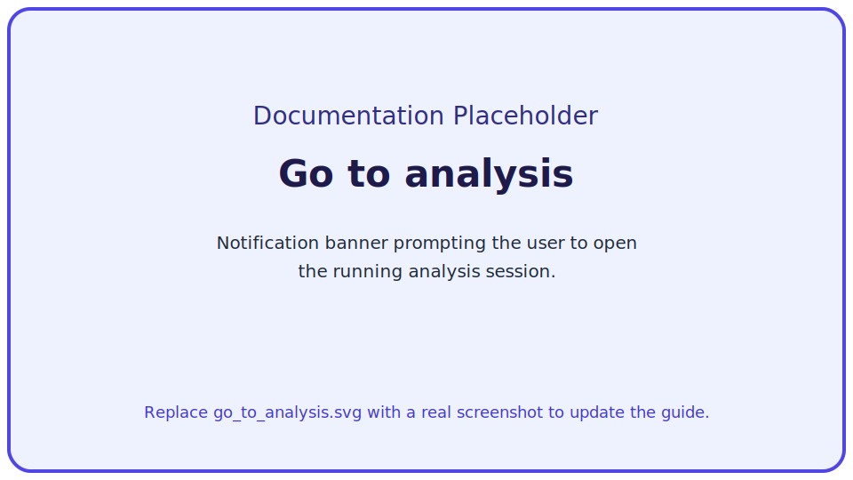
[Raw photo location: go_to_analysis.svg](https://github.com/CU-ESIIL/defining-tipping-points-and-transformation-innovation-summit-2025__1/blob/main/docs/assets/cyverse_basics/go_to_analysis.svg)

5. Now you should see Jupyter Lab!
   
[Raw photo location: jupyterlab.svg](https://github.com/CU-ESIIL/defining-tipping-points-and-transformation-innovation-summit-2025__1/blob/main/docs/assets/cyverse_basics/jupyterlab.svg)

## Set up your GitHub credentials

### If you would prefer to follow a video instead of a written outline, we have prepared a video here:

1. From Jupyter Lab, click on the Git Extension icon on the left menu:
   
[Raw photo location: jupyterlab.svg](https://github.com/CU-ESIIL/defining-tipping-points-and-transformation-innovation-summit-2025__1/blob/main/docs/assets/cyverse_basics/jupyterlab.svg)

2. Click `Clone a Repository` and Paste the link to the cyverse-utils [https://github.com/CU-ESIIL/cyverse-utils.git](https://github.com/CU-ESIIL/cyverse-utils.git) and click `Clone`:
   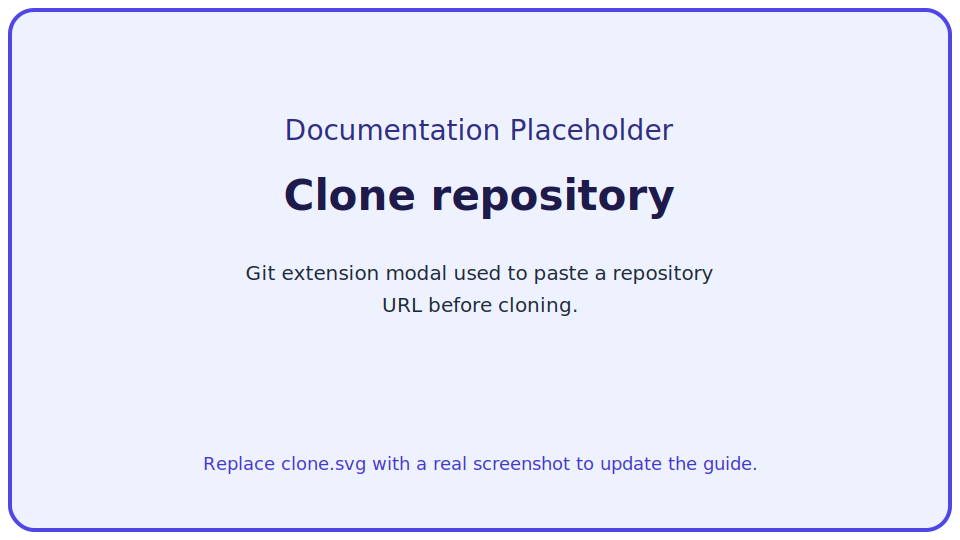
[Raw photo location: clone.svg](https://github.com/CU-ESIIL/defining-tipping-points-and-transformation-innovation-summit-2025__1/blob/main/docs/assets/cyverse_basics/clone.svg)
   
3. You should now see the `cyverse-utils` folder in your directory tree (provided you haven't changed directories from the default `/home/jovyan/data-store`
   
[Raw photo location: cyverse-utils.svg](https://github.com/CU-ESIIL/defining-tipping-points-and-transformation-innovation-summit-2025__1/blob/main/docs/assets/cyverse_basics/cyverse-utils.svg)

4. Go into the `cyverse-utils` folder:
   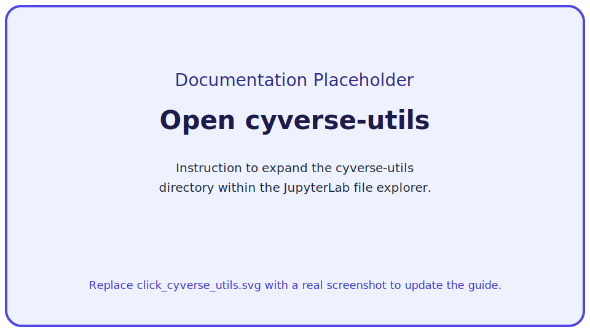
[Raw photo location: click_cyverse_utils.svg](https://github.com/CU-ESIIL/defining-tipping-points-and-transformation-innovation-summit-2025__1/blob/main/docs/assets/cyverse_basics/click_cyverse_utils.svg)

5. open up the `create_github_keypair.ipynb` notebook if you prefer Python or the 'create_github_keypair.R' script if you prefer R by double-clicking and then select the default 'macrosystems' kernel:
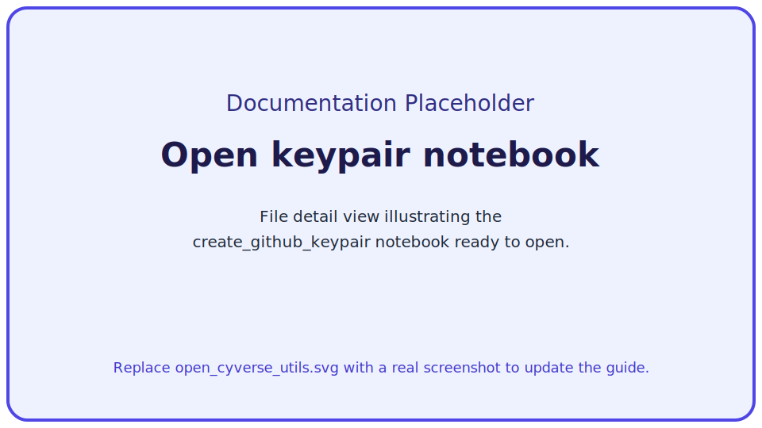
[Raw photo location: open_cyverse_utils.svg](https://github.com/CU-ESIIL/defining-tipping-points-and-transformation-innovation-summit-2025__1/blob/main/docs/assets/cyverse_basics/open_cyverse_utils.svg)

6. Now you should see the notebook open. Click the `play` button at the top. You will be prompted to enter your GitHub username and email:
   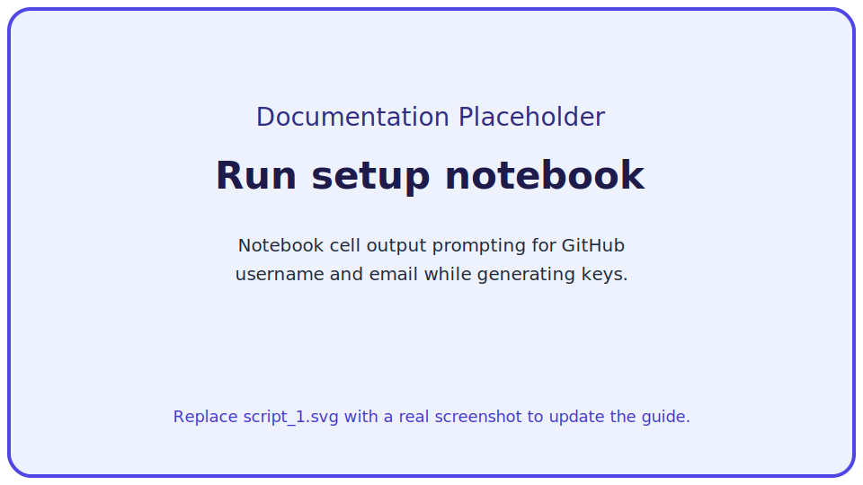
[Raw photo location: script_1.svg](https://github.com/CU-ESIIL/defining-tipping-points-and-transformation-innovation-summit-2025__1/blob/main/docs/assets/cyverse_basics/script_1.svg)

   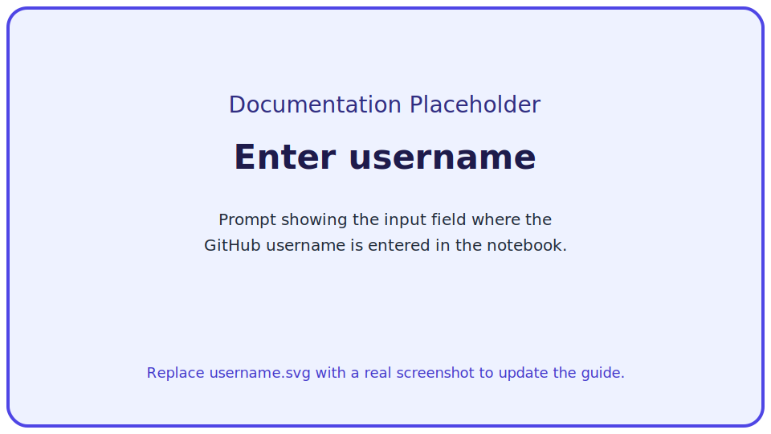
[Raw photo location: username.svg](https://github.com/CU-ESIIL/defining-tipping-points-and-transformation-innovation-summit-2025__1/blob/main/docs/assets/cyverse_basics/username.svg)

   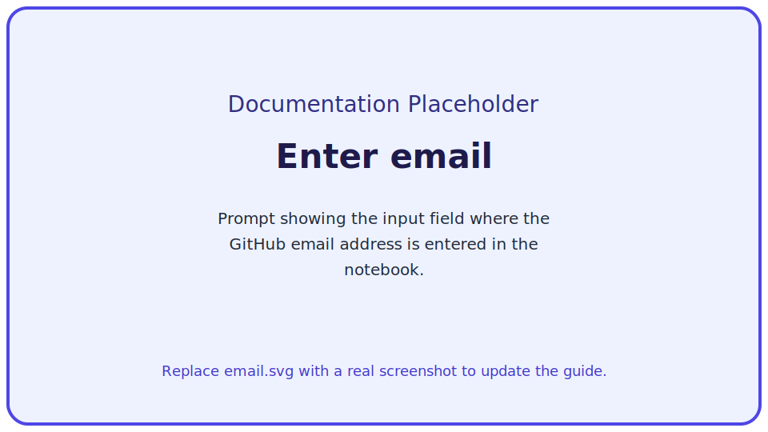
[Raw photo location: email.svg](https://github.com/CU-ESIIL/defining-tipping-points-and-transformation-innovation-summit-2025__1/blob/main/docs/assets/cyverse_basics/email.svg)

7. You should now see your Public Key. Copy the WHOLE LINE including `ssh-ed25519` at the beginning and the `jovyan@...` at the end
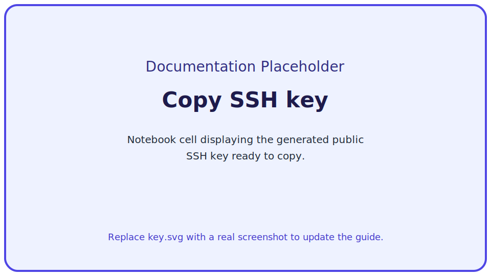
[Raw photo location: key.svg](https://github.com/CU-ESIIL/defining-tipping-points-and-transformation-innovation-summit-2025__1/blob/main/docs/assets/cyverse_basics/key.svg)

8. Go to your GitHub settings page (you may need to log in to GitHub first):
   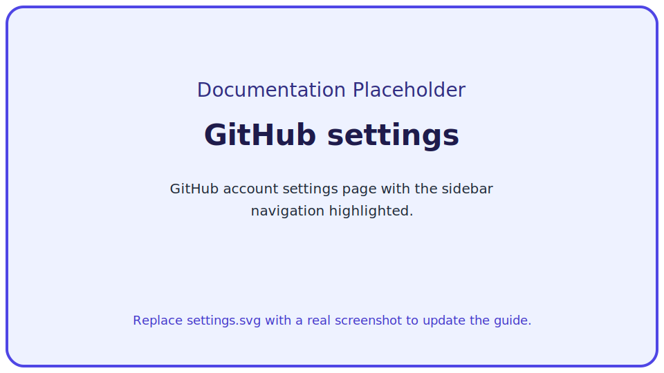
[Raw photo location: settings.svg](https://github.com/CU-ESIIL/defining-tipping-points-and-transformation-innovation-summit-2025__1/blob/main/docs/assets/cyverse_basics/settings.svg)

9. Select `SSH and GPG keys`
   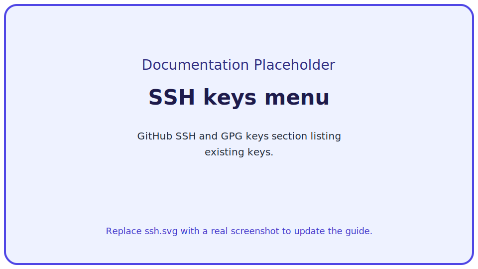
[Raw photo location: ssh.svg](https://github.com/CU-ESIIL/defining-tipping-points-and-transformation-innovation-summit-2025__1/blob/main/docs/assets/cyverse_basics/ssh.svg)

10. Select `New SSH key`
   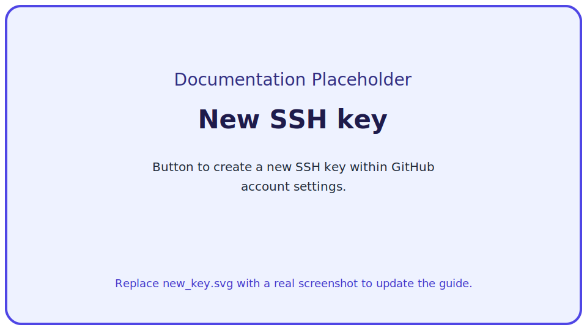
[Raw photo location: new_key.svg](https://github.com/CU-ESIIL/defining-tipping-points-and-transformation-innovation-summit-2025__1/blob/main/docs/assets/cyverse_basics/new_key.svg)

11. Give your key a descriptive name, paste your ENTIRE public key in the `Key` input box, and click `Add SSH Key`. You may need to re-authenticate with your password or two-factor authentication.:
   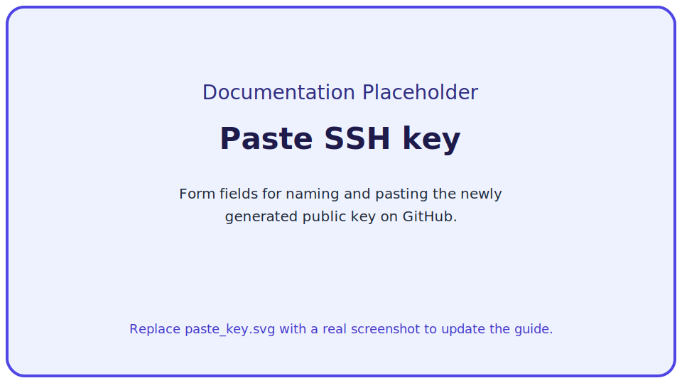
[Raw photo location: paste_key.svg](https://github.com/CU-ESIIL/defining-tipping-points-and-transformation-innovation-summit-2025__1/blob/main/docs/assets/cyverse_basics/paste_key.svg)

12. You should now see your new SSH key in your `Authentication Keys` list! Now you will be able to clone private repositories and push changes to GitHub from your Cyverse analysis!
   
[Raw photo location: final.svg](https://github.com/CU-ESIIL/defining-tipping-points-and-transformation-innovation-summit-2025__1/blob/main/docs/assets/cyverse_basics/final.svg)

> NOTE! Your GitHub authentication is ONLY for the analysis you're working with right now. You will be able to use it as long as you want there, but once you start a new analysis you will need to go through this process again. Feel free to delete keys from old analyses that have been shut down.
